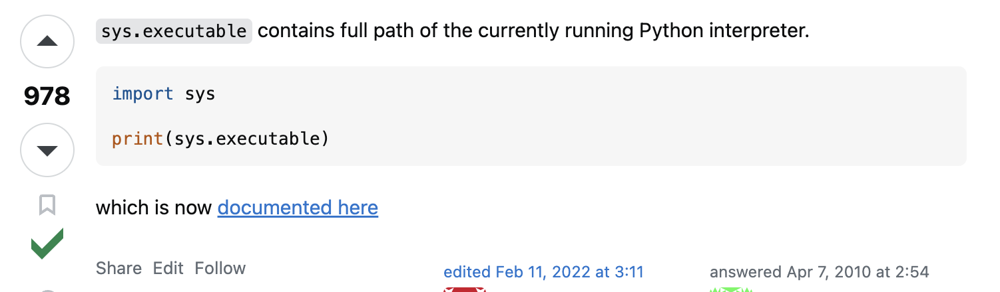

# Notes June 18, 2024

Today I installed python 3.12 since
I had python 3.11.

1) I went to python website and installed. It was straightforward

2) I had to create new virtual environment for python 3.12 in vscode.
In order to do that I had to go to:

https://stackoverflow.com/questions/2589711/find-full-path-of-the-python-interpreter-python-executable



The solution was to do the above. In case the screenshot
is not visible, I did:

```
import sys

print(sys.executable)
```

which helped me find the full path for python 3.12 which helped
me configure my venv on Vscode.